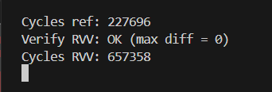
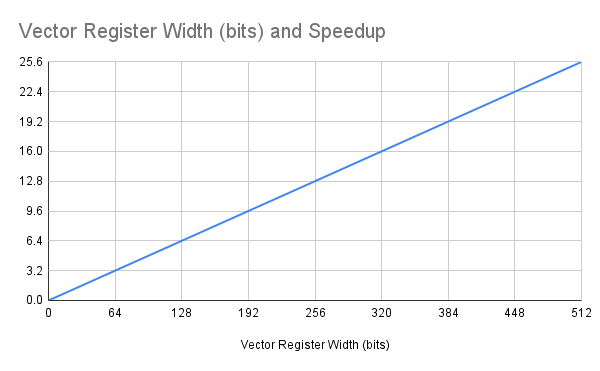

# Measured Results of My Solution the RISC-V AudioMark™ Mentorship Challenge

by Abdullah Fatota [[1]](https://github.com/new-AF/challenge-rvv-audiomark-mentorship)

## Speedup

> The expected speedup is between **1.6x** for a 32-bit vector register, up to **25.6x** for a 512-bit vector register.
>
> The speedup formula is **`0.05 x Vector Register Width`**
>
> Because our elements are `int16_t`, the expected speedup is **`0.8 x VL`** or **`0.8 x vectorLength`**
>
> _(`vectorLength` is the number of `int16_t` elements that can be packed in a vector register)_

### Backstory



I ran my compiled _ELF_ solution on `qemu-riscv32` and even though the cycle counter shows the RVV solution being slower than the scalar option ( ~657k instructions vs ~227k), this is because `qemu` is not a cycle-accurate emulator and does not emulate the RVV hardware pipeline. It instead transforms the RVV instructions into individual scalar instructions while being functionally correct with the end results and RVV spec. [[3]](https://research.samsung.com/blog/Bringing-RVV-to-Life-Overcoming-Hardware-Gaps-in-RISC-V-Development)

I tried to compile `gem5` twice hoping it might have a better RVV performance but my hardware-vulnerable [[4]](https://blog.talli.ai/intel-cpu-security-flaw-settlement/) and slow Intel Gen11 i3 laptop became unresponsive.

So we have to disassemble the binary outputs of both the scalar and vectorized versions to calculate the instruction count _per_ element.

### Scalar solution disassembly analysis

```
000102ec <q15_axpy_ref>:
q15_axpy_ref():
   102ec:	02d05b63          	blez	a3,10322 <q15_axpy_ref+0x36>
   102f0:	0686                	slli	a3,a3,0x1
   102f2:	96aa                	add	a3,a3,a0
   102f4:	68a1                	lui	a7,0x8
   102f6:	7e61                	lui	t3,0xffff8
   102f8:	00059783          	lh	a5,0(a1)
   102fc:	00051303          	lh	t1,0(a0)
   10300:	fff88813          	addi	a6,a7,-1 # 7fff <exit-0x80b5>
   10304:	02e787b3          	mul	a5,a5,a4
   10308:	979a                	add	a5,a5,t1
   1030a:	0117d563          	bge	a5,a7,10314 <q15_axpy_ref+0x28>
   1030e:	01c7cb63          	blt	a5,t3,10324 <q15_axpy_ref+0x38>
   10312:	883e                	mv	a6,a5
   10314:	01061023          	sh	a6,0(a2)
   10318:	0509                	addi	a0,a0,2
   1031a:	0589                	addi	a1,a1,2
   1031c:	0609                	addi	a2,a2,2
   1031e:	fcd51de3          	bne	a0,a3,102f8 <q15_axpy_ref+0xc>
   10322:	8082                	ret
   10324:	7861                	lui	a6,0xffff8
   10326:	b7fd                	j	10314 <q15_axpy_ref+0x28>
```

```c
void q15_axpy_ref(const int16_t *a, const int16_t *b,
                  int16_t *y, int n, int16_t alpha)
{
    for (int i = 0; i < n; ++i)
    {
        int32_t acc = (int32_t)a[i] + (int32_t)alpha * (int32_t)b[i];
        y[i] = sat_q15_scalar(acc);
    }
}
```

Let's ignore the initializations and focus on the `for` loop because that's where the majority of execution time is spent, from address `102f8` .

> The CPU runs **12 instructions** per **single** element when there's no positive or negative saturation, when the interim `int32_t` value is within the `int16_t` range. These are:

```
1. 102f8: lh a5,0(a1)        // load b[0]
2. 102fc: lh t1,0(a0)        // load a[0]
3. 10300: addi a6,a7,-1      // a6 = 0x7fff
4. 10304: mul a5,a5,a4       // b[0] * alpha
5. 10308: add a5,a5,t1       // result + a[i]
6. 1030a: bge a5,a7,10314    // not taken as result within int16_t range
7. 1030e: blt a5,t3,10324    // same not taken
8. 10312: mv a6,a5           // a6 = result
9. 10314: sh a6,0(a2)        // y[0] = a6
10. 10318: addi a0,a0,2      // a++
11. 1031a: addi a1,a1,2      // b++
12. 1031c: addi a2,a2,2      // y++
```

In case of positive saturation it's 10 instructions per single element, in case of negative saturation it's 13 instructions.

### Vectorized solution disassembly analysis

```
00010328 <q15_axpy_rvv>:
q15_axpy_rvv():
   10328:	00a05073          	csrwi	vxrm,0
   1032c:	c6a1                	beqz	a3,10374 <q15_axpy_rvv+0x4c>
   1032e:	4881                	li	a7,0
   10330:	00189813          	slli	a6,a7,0x1
   10334:	411687b3          	sub	a5,a3,a7
   10338:	0c87f7d7          	vsetvli	a5,a5,e16,m1,ta,ma
   1033c:	01058333          	add	t1,a1,a6
   10340:	02035107          	vle16.v	v2,(t1)
   10344:	01050333          	add	t1,a0,a6
   10348:	02035087          	vle16.v	v1,(t1)
   1034c:	9832                	add	a6,a6,a2
   1034e:	98be                	add	a7,a7,a5
   10350:	c6206257          	vwcvt.x.x.v	v4,v2
   10354:	c6106157          	vwcvt.x.x.v	v2,v1
   10358:	0d107057          	vsetvli	zero,zero,e32,m2,ta,ma
   1035c:	96476257          	vmul.vx	v4,v4,a4
   10360:	02220157          	vadd.vv	v2,v2,v4
   10364:	0c807057          	vsetvli	zero,zero,e16,m1,ta,ma
   10368:	be203157          	vnclip.wi	v2,v2,0
   1036c:	02085127          	vse16.v	v2,(a6)
   10370:	fcd8e0e3          	bltu	a7,a3,10330 <q15_axpy_rvv+0x8>
   10374:	8082                	ret
```

> The CPU runs **15 instructions** per the **entire** `int16_t` vector of size `vectorLength`.

```


Set by caller                         // a0 = &a[0]
                                      // a1 = &b[0]
                                      // a2 = &y[0]
                                      // a3 = n = elementCount
   1032e: li a7,0                     // elementsProcessed = 0

1. 10330: slli a6,a7,0x1              // a6 = elementsProcessed * 2 bytes; holds current batch byte offset for arrays a, b and y;
2. 10334: sub  a5,a3,a7               // remaining = elementCount - elementsProcessed
3. 10338: vsetvli a5,a5,e16,m1        // vectorLength = min(remaining, VLMAX)

4. 1033c: add  t1,a1,a6               // t1 = &b[0] + byte offset; t1 = &b[elementsProcessed]
5. 10340: vle16.v v2,(t1)             // tempVectorB = b[elementsProcessed : elementsProcessed+vectorLength]

6. 10344: add  t1,a0,a6               // t1 = &a[elementsProcessed]
7. 10348: vle16.v v1,(t1)             // tempVectorA = a[elementsProcessed : elementsProcessed+vectorLength]

8. 10350: vwcvt.x.x.v v4,v2           // vectorB = widen tempVectorB from int16_t to int32_t
9. 10354: vwcvt.x.x.v v2,v1           // vectorA = widen tempVectorA

10. 10358: vsetvli zero,zero,e32,m2    // set LMUL = 2; a logical register now spans 2 hardware registers for int32_t elements. This keeps vectorLength math the same for the current batch.

11. 1035c: vmul.vx v4,v4,a4            // vectorMultiplied = vectorB * alpha
12. 10360: vadd.vv v2,v2,v4            // vectorSum = vectorMultiplied + vectorA

13. 10364: vsetvli zero,zero,e16,m1    // set LMUL = 1; switch back to int16_t vectors

14. 10368: vnclip.wi v2,v2,0           // vectorY = saturate and narrow vectorSum elements from int32_t to int16_t

15. 1036c: vse16.v v2,(a6)             //  y[elementsProcessed : elementsProcessed+vectorLength] = vectorY
```

So 1 element costs `15 / vectorLength` instructions in the vectorized solution, as opposed to `12` in the scalar solution.

The Speedup = `Scalar instructions per element / Vector instructions per element`

The Speedup = `12 / (15 / vectorLength)`

The Speedup = `12 * vectorLength / 15`

> The Speedup = `0.8 * vectorLength`
>
> Because `vectorLength` = `vectorWidthInBits / 16`
>
> The Speedup in terms of Vector Register Width = `0.05 * vectorWidthInBits`

#### Concrete calculations:

| `vectorLength` | Vector Register Width (bits) | Speedup |
| -------------- | ---------------------------- | ------- |
| 1              | 16                           | 0.8     |
| 2              | 32                           | 1.6     |
| 3              | 48                           | 2.4     |
| 4              | 64                           | 3.2     |
| 5              | 80                           | 4       |
| 6              | 96                           | 4.8     |
| 7              | 112                          | 5.6     |
| 8              | 128                          | 6.4     |
| 9              | 144                          | 7.2     |
| 10             | 160                          | 8       |
| 11             | 176                          | 8.8     |
| 12             | 192                          | 9.6     |
| 13             | 208                          | 10.4    |
| 14             | 224                          | 11.2    |
| 15             | 240                          | 12      |
| 16             | 256                          | 12.8    |
| 17             | 272                          | 13.6    |
| 18             | 288                          | 14.4    |
| 19             | 304                          | 15.2    |
| 20             | 320                          | 16      |
| 21             | 336                          | 16.8    |
| 22             | 352                          | 17.6    |
| 23             | 368                          | 18.4    |
| 24             | 384                          | 19.2    |
| 25             | 400                          | 20      |
| 26             | 416                          | 20.8    |
| 27             | 432                          | 21.6    |
| 28             | 448                          | 22.4    |
| 29             | 464                          | 23.2    |
| 30             | 480                          | 24      |
| 31             | 496                          | 24.8    |
| 32             | 512                          | 25.6    |



## References

[[1] https://github.com/new-AF/challenge-rvv-audiomark-mentorship](https://github.com/new-AF/challenge-rvv-audiomark-mentorship)

[[2] https://docs.google.com/document/d/1BLO9GU57161sGLYuBxm7MzcDJSVZIj5OYhqFli7t-Y0/edit?tab=t.0](https://docs.google.com/document/d/1BLO9GU57161sGLYuBxm7MzcDJSVZIj5OYhqFli7t-Y0/edit?tab=t.0)

[[3] https://research.samsung.com/blog/Bringing-RVV-to-Life-Overcoming-Hardware-Gaps-in-RISC-V-Development](https://research.samsung.com/blog/Bringing-RVV-to-Life-Overcoming-Hardware-Gaps-in-RISC-V-Development)

[[4] https://blog.talli.ai/intel-cpu-security-flaw-settlement/](https://blog.talli.ai/intel-cpu-security-flaw-settlement/)

[[5] https://github.com/riscv-collab/riscv-gnu-toolchain](https://github.com/riscv-collab/riscv-gnu-toolchain)
