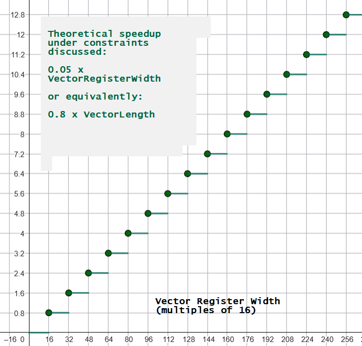
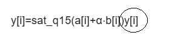
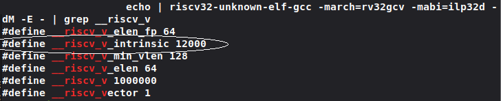
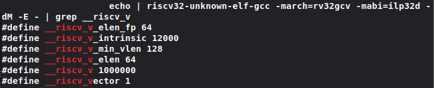

# My Solution, Design Choices and Measured Results to the RISC-V AudioMark Mentorship Challenge

by Abdullah Fatota [[1]](https://github.com/new-AF/challenge-rvv-audiomark-mentorship)

- [My Solution, Design Choices and Measured Results to the RISC-V AudioMark Mentorship Challenge](#my-solution-design-choices-and-measured-results-to-the-risc-v-audiomark-mentorship-challenge)
- [Link to my GitHub solution](#link-to-my-github-solution)
- [My vectorized solution](#my-vectorized-solution)
  - [Correctness output](#correctness-output)
  - [Design decisions](#design-decisions)
  - [Meaningful variable names](#meaningful-variable-names)
  - [The `for` loop design pattern](#the-for-loop-design-pattern)
  - [Loading chunks into the vector](#loading-chunks-into-the-vector)
  - [Widening vector elements from `int16_t` to `int32_t`](#widening-vector-elements-from-int16_t-to-int32_t)
  - [Performing scalar-vector calculation](#performing-scalar-vector-calculation)
  - [Performing vector-vector calculation](#performing-vector-vector-calculation)
  - [Narrowing down the output vector from `int32_t` to `int16_t`](#narrowing-down-the-output-vector-from-int32_t-to-int16_t)
  - [Storing the nascent `int16_t` vector](#storing-the-nascent-int16_t-vector)
- [Measured results and speedup](#measured-results-and-speedup)
  - [Attempting to install cycle-accurate simulators backstory](#attempting-to-install-cycle-accurate-simulators-backstory)
  - [Shift to disassembly analysis](#shift-to-disassembly-analysis)
  - [Scalar solution disassembly analysis](#scalar-solution-disassembly-analysis)
  - [Vectorized solution disassembly analysis](#vectorized-solution-disassembly-analysis)
  - [Concrete calculations](#concrete-calculations)
  - [Speedup graph](#speedup-graph)
- [The challenge itself](#the-challenge-itself)
  - [Function prototype](#function-prototype)
  - [Typo in official challenge document](#typo-in-official-challenge-document)
  - [Typo in the provided boilerplate challenge .c file](#typo-in-the-provided-boilerplate-challenge-c-file)
  - [Scalar vs vectorized definitions](#scalar-vs-vectorized-definitions)
  - [Formula notes](#formula-notes)
- [Building the toolchain and running my solution](#building-the-toolchain-and-running-my-solution)
  - [Building the latest official GCC compiler](#building-the-latest-official-gcc-compiler)
  - [Compiling and running my `solution.c`](#compiling-and-running-my-solutionc)
- [References](#references)

# Link to my GitHub solution

[https://github.com/new-AF/challenge-rvv-audiomark-mentorship](https://github.com/new-AF/challenge-rvv-audiomark-mentorship)

# My vectorized solution

```c
void q15_axpy_rvv(const int16_t *a, const int16_t *b,
                  int16_t *y, int n, int16_t alpha)
{
#if !defined(__riscv) || !defined(__riscv_vector) || (__riscv_v_intrinsic < RVV_SPEC_THRESHOLD)
    // Fallback (keeps correctness off-target)
    q15_axpy_ref(a, b, y, n, alpha);
#else
    // TODO: Enter your solution here

    /*
    Goal, compute the formula:

    y[i] = sat_q15(a[i] + alpha * b[i])

    - a, b: int16_t input arrays
    - y: int16_t output array

    - alpha: int16_t scalar

    - intermediate calculations done using int32_t RISC-V Vectors (RVV)
    - result saturated/clamped to int16_t vectors

    */

    // baseline software engineering practice: give readable meaningful names to variables
    int elementCount = n;

    // hardware vector length (VL)
    size_t vectorLength = 0;

    // convert alpha to 32bit because interim vector will hold int32_t elements
    int32_t scalar = (int32_t)alpha;

    // process in batches, depending on the hardware vector length (VL) of fitting int16_t elements.
    for (size_t elementsProcessed = 0; elementsProcessed < elementCount; elementsProcessed += vectorLength)
    {

        // 1. get VL
        vectorLength = __riscv_vsetvl_e16m1(elementCount - elementsProcessed);

        // 2. load `vectorLength` int16_t elements into a vector
        vint16m1_t tempVectorA = __riscv_vle16_v_i16m1(&a[elementsProcessed], vectorLength);

        // 3. widen the int16_t elements vector to int32_t
        vint32m2_t vectorA = __riscv_vwcvt_x_x_v_i32m2(tempVectorA, vectorLength);

        // 4. and 5. do the same for array `b`
        vint16m1_t tempVectorB = __riscv_vle16_v_i16m1(&b[elementsProcessed], vectorLength);
        vint32m2_t vectorB = __riscv_vwcvt_x_x_v_i32m2(tempVectorB, vectorLength);

        // 6. scalar multiply (scalar * vectorB)
        vint32m2_t vectorMultiplied = __riscv_vmul_vx_i32m2(vectorB, scalar, vectorLength);

        // 7. sum (vectorA + vectorMultiply)
        vint32m2_t vectorSum = __riscv_vadd_vv_i32m2(vectorA, vectorMultiplied, vectorLength);

        // 8. *crucial* narrow the int32_t to int16_t by first saturating or clamping [-32768, 32767]
        // argument 2 sets right shift amount: we do 0.
        // argument 3  becomes irrelevant.
        vint16m1_t vectorY = __riscv_vnclip_wx_i16m1(vectorSum, 0, 0, vectorLength);

        // 9. store `vectorY` into array `y`
        __riscv_vse16_v_i16m1(&y[elementsProcessed], vectorY, vectorLength);
    }

#endif
}
```

## Correctness output


Run commands:

```bash
qemu-riscv32 ./solution.elf
```

## Design decisions

> The crux of my solution is to process the arrays `a, b, y`, using a **single** `for` loop, and in **batches** or increments of the dynamic **`vectorLength` (VL)**.
>
> `vectorLength` can change during each iteration, and is the count of elements to be processed by the current vector.

Rationale:

1. A **single** `for` loop makes the solution straightforward, easier to reason about and crucially **maintain**.

    Because the alternative is to have a main `for` loop for the core logic, and a cleanup code for the edge cases for the remaining elements, which would be make the whole solution _bug-prone_ and _poorly-scalable_.

2. Because `vectorLength` is **dynamic** and responsive to both the underlying width of the vector registers of the RISC-V CPU, and the remaining elements in each batch, it makes my solution fully **vector-length agnostic (VLA)**.

3. Processing in batches or chunks allows us to **subset** the array in a straightforward manner and load them into vectors for processing by RVV.

## Meaningful variable names

I used clear and descriptive variable names, instead of the ambiguous `n`, `i` and `vl` I used `elementCount`, `elementsProcessed` and `vectorLength`

> Rationale: It improves the readability of the code, makes it easier to reason about and crucially maintain.

I use the camelCase naming convention common in the TypeScript/JavaScript/Java world.

> Rationale: Personal preference.

## The `for` loop design pattern

Because `vectorLength` (VL) can change during each iteration, I used the following design pattern to loop over the all arrays (`a`, `b` and `y`) using the dynamic `vectorLength` increment:

```c
#include <riscv_vector.h> // __riscv_vsetvl_e16m1 definition

// ...

int elementCount = n;

// current vector length (VL)
size_t vectorLength = 0;

// process in batches, depending on `vectorLength` of fitting int16_t elements.
for (
    size_t elementsProcessed = 0;
    elementsProcessed < elementCount;
    elementsProcessed += vectorLength
    )
{

    // get VL
    vectorLength = __riscv_vsetvl_e16m1(elementCount - elementsProcessed);

    // rest of logic...
}
```

> Rationale:
>
> 1. Using `for` groups all the looping constructs in one accessible place.
> 2. Calling `__riscv_vsetvl_e16m1(elementCount - elementsProcessed)` returns `vectorLength` as the dynamic current batch vector length that will fit the maximum number of the remaining `int16_t` elements.
>
> For example: if our arrays are 4096 elements wide, and `vectorLength` is 10 for some uncommon architectural reason, then we do 409 batches and process 10 elements, and one final batch to process the remaining 6 elements, all in the single `for` loop with uniform code logic.
>
> `__riscv_vsetvl_e16m1` is defined as the following pseudo-code:
>
> ```c
> size_t __riscv_vsetvl_e16m1(size_t requestedVectorLength) {
>     return MIN(requestedVectorLength, VLMAX);
> }
> ```
>
> `VLMAX` is the hardware-defined vector register length for fitting `int16_t` elements.
>
> I could directly use `VLMAX` by calling `__riscv_vsetvlmax_e16m1()` but I would be duplicating brittle code by having 2 `for` loops: one for the fixed-iteration, and another "edge-case" to process the remaining elements that aren't a multiple of `VLMAX`
>
> Or I would reinvent the wheel by implementing `__riscv_vsetvl_e16m1` during each iteration as `vectorLength = MIN(elementCount - elementsProcessed, VLMAX)` so why not avoid that error-prone process and use the standard built-in intrinsic instead.

## Loading chunks into the vector

During each batch we load `vectorLength` chunks of arrays `a` and `b` into a vector.

> Rationale: To prepare the array elements for vector processing, we first have to load them into a vector register, and we call:
>
> ```c
> vint16m1_t __riscv_vle16_v_i16m1(const int16_t *base, size_t vectorLength);
> ```
>
> `base` is our location in the array (e.g. `a`) after having processed `elementsProcessed` elements.
>
> ```c
> vint16m1_t tempVectorA = __riscv_vle16_v_i16m1(&a[elementsProcessed], vectorLength);
> vint16m1_t tempVectorB = __riscv_vle16_v_i16m1(&b[elementsProcessed], vectorLength);
> ```

## Widening vector elements from `int16_t` to `int32_t`

> Rationale: This is because subsequent computations, namely the scalar multiplication and addition can easily exceed the `int16_t` range and crucially overflow to the wrong values, therefore we use a wider type with bigger range.
>
> The intrinsic to do that is:
>
> ```c
> vint32m2_t __riscv_vwcvt_x_x_v_i32m2(vint16m1_t src, size_t vectorLength);
> ```
>
> As widening the elements from `int16_t` to `int32_t` **halves** the number of elements that can be packed inside the same hardware register, this halves `vectorLength` (VL) too.
>
> In order to retain the **same** `vectorLength` and **widen** the elements we set **`LMUL = 2`** or the Logical Multiplier.
>
> Why do I need to retain the same `vectorLength`? why I couldn't allocate a shorter `int32_t` vector?
>
> Because it would complicate the code and make it error-prone, adding an inner `for` loop and tracking 2 different `vectorLength`s: one for the `int16_t` and the other for `int32_t` elements.
>
> `LMUL = 2` combines 2 hardware registers with double the bits, to act as 1 logical register, thereby keeping `vectorLength` the same, but holding the now widened `int32_t` elements.
>
> ```c
> vint32m2_t vectorA = __riscv_vwcvt_x_x_v_i32m2(tempVectorA, vectorLength);
> vint32m2_t vectorB = __riscv_vwcvt_x_x_v_i32m2(tempVectorB, vectorLength);
> ```

## Performing scalar-vector calculation

We perform the scalar-vector calculation `alpha * vectorB` by calling `__riscv_vmul_vx_i32m2`

> Rationale:
> This is to satisfy the `alpha * b[i]` part of the scalar formula, and get the **speedup** by using only one instruction (multiply with scalar `alpha`) on the entire vector of elements.
>
> ```c
> vint32m2_t __riscv_vmul_vx_i32m2(vint32m2_t src_vector, int32_t scalar, size_t vectorLength);
> ```
>
> ```c
> vint32m2_t vectorMultiplied = __riscv_vmul_vx_i32m2(vectorB, scalar, vectorLength);
> ```

## Performing vector-vector calculation

We perform the vector-vector calculations `vectorA + (alpha * vectorB)` by calling `__riscv_vadd_vv_i32m2`

> Rationale:
> This is to satisfy the `a[i] + (alpha * b[i])` part of the scalar formula, and get the **speedup** by using only one instruction: adding 2 vectors element-wise.
>
> ```c
> vint32m2_t __riscv_vadd_vv_i32m2(vint32m2_t vectorA, vint32m2_t vectorB, size_t vectorLength);
> ```
>
> ```c
> vint32m2_t vectorSum = __riscv_vadd_vv_i32m2(vectorA, vectorMultiplied, vectorLength);
> ```

## Narrowing down the output vector from `int32_t` to `int16_t`

We narrow (or saturate) the output `int32_t` vector `vectorY = vectorA + (alpha * vectorB)` into a vector of `int16_t` elements.

> Rationale:
> This is because our AXPY formula requires `int16_t` output as its inputs are `int16_t` due to various reasons (hardware constraints, it's sufficient for its audio signal purposes)
>
> We do this by calling `__riscv_vnclip_wx_i16m1` which has the prototype:
>
> ```c
> vint16m1_t __riscv_vnclip_wx_i16m1(vint32m2_t src, int32_t shift, uint32_t opc, size_t vectorLength);
> ```
>
> - `src` is our target vector
> - `shift` is the amount of right shift to do, before saturation, we don't need any so we put in `0`.
> - `opc` is the options code for the rounding mode after doing a right shift, because we set `shift = 0`, this argument is completely ignored.
>
> ```c
> vint16m1_t vectorY = __riscv_vnclip_wx_i16m1(vectorSum, 0, 0, vectorLength);
> ```
>
> Any values outside the `int16_t` range [-32768, 32767] were clamped (or saturated) to the end range values.

## Storing the nascent `int16_t` vector

We complete the formula calculation by storing the vector results back into output array `y`

> Rationale:
> This is to satisfy the `y[i] = a[i] + (alpha * b[i])` part of the scalar formula, and get the **speedup** by using only one instruction: storing the register back into memory, by calling `__riscv_vse16_v_i16m1`.
>
> ```c
> void __riscv_vse16_v_i16m1(int16_t *base, vint16m1_t value, size_t vectorLength);
> ```
>
> `base` is the memory address in the output array after having stored `elementsProcessed` elements.
>
> ```c
> __riscv_vse16_v_i16m1(&y[elementsProcessed], vectorY, vectorLength);
> ```

By storing `vectorY` into output array `y` we have completed the current batch, and simultaneously processed `vectorLength` worth of elements (e.g.32, 64, 128, etc. depending on the RISC-V CPU) using only a **handful** of instructions which leads to a significant speedup as I will demonstrate later.

# Measured results and speedup

> Under the constraints discussed below, the expected speedup is between **1.6x** for a 32-bit vector register, **12.8x** for a 256-bit vector register, and up to **25.6x** for a 512-bit vector register.
>
> Constraints:
>
> 1. My analysis assumes a purely theoretical instruction-counting model, it does not account for real-hardware drains like instruction and memory latency, cache behavior or vector unit architecture.
> 2. Crucially, each RVV instruction discussed has O(1) runtime complexity, or the work performed is independent of the register width, which might not be true on real hardware.
> 3. Vector Register Width is a multiple of 16.
>
> Speedup formula:
>
> - Under such constraints the speedup formula is **`0.8 x vectorLength (VL)`**
> - Or equivalently: **`0.05 x VectorRegisterWidth`**
>
> Under such model every additional input `int16_t` element packed in a vector register yields an absolute speedup of **0.8x**

## Attempting to install cycle-accurate simulators backstory


I ran my compiled _ELF_ solution on `qemu-riscv32` and even though the cycle counter shows the RVV solution being slower than the scalar option ( ~657k instructions vs ~227k), this is because `qemu` is not a cycle-accurate emulator and does not emulate the RVV hardware pipeline. It instead transforms the RVV instructions into individual scalar instructions while being functionally correct with the end results and RVV specification. [[3]](https://research.samsung.com/blog/Bringing-RVV-to-Life-Overcoming-Hardware-Gaps-in-RISC-V-Development)

I tried to compile `gem5` twice hoping it might have a better RVV performance but my hardware-vulnerable [[4]](https://blog.talli.ai/intel-cpu-security-flaw-settlement/) and slow Intel Gen11 i3 laptop became unresponsive.

## Shift to disassembly analysis

In light of the above limitations and lack of real RISC-V hardware I had to disassemble and analyze the binary outputs of both the scalar and vectorized versions and calculate the instruction count _per_ element.

## Scalar solution disassembly analysis

```
000102ec <q15_axpy_ref>:
q15_axpy_ref():
   102ec:	02d05b63          	blez	a3,10322 <q15_axpy_ref+0x36>
   102f0:	0686                	slli	a3,a3,0x1
   102f2:	96aa                	add	a3,a3,a0
   102f4:	68a1                	lui	a7,0x8
   102f6:	7e61                	lui	t3,0xffff8
   102f8:	00059783          	lh	a5,0(a1)
   102fc:	00051303          	lh	t1,0(a0)
   10300:	fff88813          	addi	a6,a7,-1 # 7fff <exit-0x80b5>
   10304:	02e787b3          	mul	a5,a5,a4
   10308:	979a                	add	a5,a5,t1
   1030a:	0117d563          	bge	a5,a7,10314 <q15_axpy_ref+0x28>
   1030e:	01c7cb63          	blt	a5,t3,10324 <q15_axpy_ref+0x38>
   10312:	883e                	mv	a6,a5
   10314:	01061023          	sh	a6,0(a2)
   10318:	0509                	addi	a0,a0,2
   1031a:	0589                	addi	a1,a1,2
   1031c:	0609                	addi	a2,a2,2
   1031e:	fcd51de3          	bne	a0,a3,102f8 <q15_axpy_ref+0xc>
   10322:	8082                	ret
   10324:	7861                	lui	a6,0xffff8
   10326:	b7fd                	j	10314 <q15_axpy_ref+0x28>
```

```c
void q15_axpy_ref(const int16_t *a, const int16_t *b,
                  int16_t *y, int n, int16_t alpha)
{
    for (int i = 0; i < n; ++i)
    {
        int32_t acc = (int32_t)a[i] + (int32_t)alpha * (int32_t)b[i];
        y[i] = sat_q15_scalar(acc);
    }
}
```

Let's ignore the initializations and focus on the `for` loop because that's where the majority of execution time is spent, from address `102f8` .

> The CPU runs **12 instructions** per **single** element when there's no positive or negative saturation, when the interim `int32_t` value is within the `int16_t` range. These are:

```
1. 102f8: lh a5,0(a1)        // load b[0]
2. 102fc: lh t1,0(a0)        // load a[0]
3. 10300: addi a6,a7,-1      // a6 = 0x7fff
4. 10304: mul a5,a5,a4       // b[0] * alpha
5. 10308: add a5,a5,t1       // result + a[i]
6. 1030a: bge a5,a7,10314    // not taken as result within int16_t range
7. 1030e: blt a5,t3,10324    // same not taken
8. 10312: mv a6,a5           // a6 = result
9. 10314: sh a6,0(a2)        // y[0] = a6
10. 10318: addi a0,a0,2      // a++
11. 1031a: addi a1,a1,2      // b++
12. 1031c: addi a2,a2,2      // y++
```

In case of positive saturation it's 10 instructions per single element, in case of negative saturation it's 13 instructions.

## Vectorized solution disassembly analysis

```
00010328 <q15_axpy_rvv>:
q15_axpy_rvv():
   10328:	00a05073          	csrwi	vxrm,0
   1032c:	c6a1                	beqz	a3,10374 <q15_axpy_rvv+0x4c>
   1032e:	4881                	li	a7,0
   10330:	00189813          	slli	a6,a7,0x1
   10334:	411687b3          	sub	a5,a3,a7
   10338:	0c87f7d7          	vsetvli	a5,a5,e16,m1,ta,ma
   1033c:	01058333          	add	t1,a1,a6
   10340:	02035107          	vle16.v	v2,(t1)
   10344:	01050333          	add	t1,a0,a6
   10348:	02035087          	vle16.v	v1,(t1)
   1034c:	9832                	add	a6,a6,a2
   1034e:	98be                	add	a7,a7,a5
   10350:	c6206257          	vwcvt.x.x.v	v4,v2
   10354:	c6106157          	vwcvt.x.x.v	v2,v1
   10358:	0d107057          	vsetvli	zero,zero,e32,m2,ta,ma
   1035c:	96476257          	vmul.vx	v4,v4,a4
   10360:	02220157          	vadd.vv	v2,v2,v4
   10364:	0c807057          	vsetvli	zero,zero,e16,m1,ta,ma
   10368:	be203157          	vnclip.wi	v2,v2,0
   1036c:	02085127          	vse16.v	v2,(a6)
   10370:	fcd8e0e3          	bltu	a7,a3,10330 <q15_axpy_rvv+0x8>
   10374:	8082                	ret
```

> The CPU runs **15 instructions** per the **entire** `int16_t` vector of size `vectorLength`.

```


Set by caller                         // a0 = &a[0]
                                      // a1 = &b[0]
                                      // a2 = &y[0]
                                      // a3 = n = elementCount
   1032e: li a7,0                     // elementsProcessed = 0

1. 10330: slli a6,a7,0x1              // a6 = elementsProcessed * 2 bytes; holds current batch byte offset for arrays a, b and y;
2. 10334: sub  a5,a3,a7               // remaining = elementCount - elementsProcessed
3. 10338: vsetvli a5,a5,e16,m1        // vectorLength = min(remaining, VLMAX)

4. 1033c: add  t1,a1,a6               // t1 = &b[0] + byte offset; t1 = &b[elementsProcessed]
5. 10340: vle16.v v2,(t1)             // tempVectorB = b[elementsProcessed : elementsProcessed+vectorLength]

6. 10344: add  t1,a0,a6               // t1 = &a[elementsProcessed]
7. 10348: vle16.v v1,(t1)             // tempVectorA = a[elementsProcessed : elementsProcessed+vectorLength]

8. 10350: vwcvt.x.x.v v4,v2           // vectorB = widen tempVectorB from int16_t to int32_t
9. 10354: vwcvt.x.x.v v2,v1           // vectorA = widen tempVectorA

10. 10358: vsetvli zero,zero,e32,m2    // set LMUL = 2; a logical register now spans 2 hardware registers for int32_t elements. This keeps vectorLength math the same for the current batch.

11. 1035c: vmul.vx v4,v4,a4            // vectorMultiplied = vectorB * alpha
12. 10360: vadd.vv v2,v2,v4            // vectorSum = vectorMultiplied + vectorA

13. 10364: vsetvli zero,zero,e16,m1    // set LMUL = 1; switch back to int16_t vectors

14. 10368: vnclip.wi v2,v2,0           // vectorY = saturate and narrow vectorSum elements from int32_t to int16_t

15. 1036c: vse16.v v2,(a6)             //  y[elementsProcessed : elementsProcessed+vectorLength] = vectorY
```

> So 1 element costs `15 / vectorLength` instructions in the vectorized solution, as opposed to `12` in the scalar solution.
>
> This assumes that RVV instructions cost is **O(1)** or independent regardless of the register width, which might be true on real hardware.

The theoretical speedup = `Scalar instructions per element / Vector instructions per element`

Theoretical speedup = `12 / (15 / vectorLength)`

Theoretical speedup = `12 * vectorLength / 15`

> Theoretical speedup = `0.8 * vectorLength`
>
> Because `vectorLength` = `vectorWidthInBits / 16`
>
> Interpolating the theoretical speedup in terms of Vector Register Width = `0.05 * vectorWidthInBits`

## Concrete calculations

| `vectorLength` | Vector Register Width (bits) | Speedup |
| -------------- | ---------------------------- | ------- |
| 1              | 16                           | 0.8     |
| 2              | 32                           | 1.6     |
| 3              | 48                           | 2.4     |
| 4              | 64                           | 3.2     |
| 5              | 80                           | 4       |
| 6              | 96                           | 4.8     |
| 7              | 112                          | 5.6     |
| 8              | 128                          | 6.4     |
| 9              | 144                          | 7.2     |
| 10             | 160                          | 8       |
| 11             | 176                          | 8.8     |
| 12             | 192                          | 9.6     |
| 13             | 208                          | 10.4    |
| 14             | 224                          | 11.2    |
| 15             | 240                          | 12      |
| 16             | 256                          | 12.8    |
| 17             | 272                          | 13.6    |
| 18             | 288                          | 14.4    |
| 19             | 304                          | 15.2    |
| 20             | 320                          | 16      |
| 21             | 336                          | 16.8    |
| 22             | 352                          | 17.6    |
| 23             | 368                          | 18.4    |
| 24             | 384                          | 19.2    |
| 25             | 400                          | 20      |
| 26             | 416                          | 20.8    |
| 27             | 432                          | 21.6    |
| 28             | 448                          | 22.4    |
| 29             | 464                          | 23.2    |
| 30             | 480                          | 24      |
| 31             | 496                          | 24.8    |
| 32             | 512                          | 25.6    |

## Speedup graph



# The challenge itself

Implement a _vectorized_ _C_ function _(`q15_axpy_rvv`)_ that uses the RISC-V Vector instructions (RVV) to compute the scalar formula [[2]](https://docs.google.com/document/d/1BLO9GU57161sGLYuBxm7MzcDJSVZIj5OYhqFli7t-Y0/edit?tab=t.0):

```

y[i] = sat_q15(a[i] + alpha * b[i])

```

## Function prototype

```c
void q15_axpy_rvv(
    const int16_t *a,
    const int16_t *b,
    int16_t *y,
    int n,
    int16_t alpha
)
```

- `a` and `b` are input arrays, of `int16_t` elements.
- `y` is the output array, of `int16_t` elements.
- `n` is the length of `a`, `b` and `y`.
- `alpha` is a singular (scalar) value.

## Typo in official challenge document

In the challenge document [[2]](https://docs.google.com/document/d/1BLO9GU57161sGLYuBxm7MzcDJSVZIj5OYhqFli7t-Y0/edit?tab=t.0) the formula has a typo, the additional y[i] at the end



> Rationale:
> The formula AXPY is standard in linear algebra and signal processing applications [[6]](https://www.cs.utexas.edu/~flame/laff/pfhp/week1-the-axpy-operation.html) and is the following:
>
> y = ax + y [[6]](https://www.cs.utexas.edu/~flame/laff/pfhp/week1-the-axpy-operation.html)
>
>  [[6]](https://www.cs.utexas.edu/~flame/laff/pfhp/week1-the-axpy-operation.html)
>
> In addition the reference scalar solution `q15_axpy_ref` clearly matches the standard (ax + y) definition
>
> ```c
> void q15_axpy_ref(const int16_t *a, const int16_t *b, int16_t *y, int n, int16_t alpha)
> {
>     for (int i = 0; i < n; ++i)
>     {
>         int32_t acc = (int32_t)a[i] + (int32_t)alpha * (int32_t)b[i];
>         y[i] = sat_q15_scalar(acc);
>     }
> }
> ```

## Typo in the provided boilerplate challenge .c file

The challenge boilerplate .c file [[7]](https://godbolt.org/z/h483Erh7G) has a typo in the preprocessor conditional directive, specifically **line 36** and condition **`(__riscv_v_intrinsic < 1000000)`**

If left unchanged, it will **not** run your RVV solution function (`q15_axpy_ref`) and will always run the reference scalar solution instead (`q15_axpy_ref`).

```c
void q15_axpy_rvv(const int16_t *a, const int16_t *b,
                  int16_t *y, int n, int16_t alpha)
{
// line 36 `__riscv_v_intrinsic`
#if !defined(__riscv) || !defined(__riscv_vector) || (__riscv_v_intrinsic < 1000000)
    // Fallback (keeps correctness off-target)
    q15_axpy_ref(a, b, y, n, alpha);
#else
    // TODO: Enter your solution here
#endif
}
```

> Rationale:
> By building the latest `riscv32-unknown-elf-gcc` GCC compiler for `rv32gcv` I can confirm (see screenshot below) that `__riscv_v_intrinsic` does not go high to `1000000` that is the major version is not v1.0.
>
> At the moment it is 0.12 or **`12000`** [[8]](https://gcc.gnu.org/pipermail/gcc-cvs/2023-March/380142.html)
>
> What **does** go to v1.0 is the RVV specification macro itself **`__riscv_v`** so maybe the author was aiming for it instead.

Running the command to inspect RVV support on `riscv32-unknown-elf-gcc` confirms my findings:

```bash
echo | riscv32-unknown-elf-gcc -march=rv32gcv -mabi=ilp32d -dM -E - | grep __riscv_v
```



> **The fix:**
>
> Change **line 36** to either:
>
> - (Recommended) from `(__riscv_v_intrinsic < 1000000)` to **`(__riscv_v_intrinsic < 12000)`**
> - Or do what I initially did, which is not the best solution after researching the topic, but it works, and at the time seemed sensible, and changing it now would be impractical because it could change my compiled solution `solution.elf` whose disassembly I analyze below.
>
>     Introduce a new macro (a better name would be `RVV_INTRINSIC_SPEC_THRESHOLD` but I concluded that later):
>
> ```c
> #define RVV_SPEC_THRESHOLD 1
> ```
>
> And change **line 36**, the preprocessor condition to:
>
> ```c
> #if !defined(__riscv) || !defined(__riscv_vector) || (__riscv_v_intrinsic < RVV_SPEC_THRESHOLD)
> ```

## Scalar vs vectorized definitions

_Scalar_ means we apply a sequence operations to a **single** array element e.g.:

- `const multiplyResult = alpha * b[i]`
- `const sumResult = multiplyResult + a[i]`
- `const clampedResult = sat_q15_scalar(result)`
- `y[i] = clampedResult`

A _vectorized_ solution however applies the **same** operation on **multiple** elements **simultaneously**.

It does this by _packing_ multiple elements inside a _hardware vector register_ and applying the _same_ operation on the _entire_ vector e.g.:

- `const multiplyVector = alpha * vectorB[i : i+VL]` where `VL` is `vectorLength` or the number of elements that can be _packed_ in a single hardware vector register.
- `const sumVector = multiplyVector + vectorA[i : i+VL]`
- `const clampedAndNarrowedVector = __riscv_vnclip_wx_i16m1(sumVector)`
- `y[i : i+VL] = clampedAndNarrowedVector`

## Formula notes

```
y[i] = sat_q15(a[i] + alpha * b[i])
```

- Interim element calculations will be of type `int32_t` (doesn't matter if _scalar_ or _vectorized_).
- This is because `a[i] + alpha * b[i]` will in most cases exceed the `int16_t` range `[-32768, 32767]` and overflow to the wrong value.
- `sat_q15` clamps the `int32_t` result back to `int16_t`.

> _The vectorized solution should **not** implement `sat_q15` because the proper RVV instructions will do that internally. The reference scalar version is provided here purely for educational purposes:_

```c
int16_t sat_q15(int32_t arrayElement)
{
    if (arrayElement > 32767)
        return 32767;
    if (arrayElement < -32768)
        return -32768;
    return (int16_t)arrayElement;
}
```

# Building the toolchain and running my solution

## Building the latest official GCC compiler

I opted to build the latest official GCC toolchain provided by RISC-V International themselves [[5]](https://github.com/riscv-collab/riscv-gnu-toolchain).

It takes around 6.5GB disk space once `make` is done cloning the GitHub repo. Building itself takes around 6 hours on my weak laptop.

Here are the commands I used to build `riscv32-unknown-elf-gcc` on my _Linux Mint 22.3_ installation and successfully compile `./solution.c` with both the reference and my vectorized solution:

```bash
cd ~
mkdir build-here-riscv

# Install the userland QEMU emulator for RISC-V 32
sudo apt install qemu-user

# Install the dependencies for GCC
sudo apt-get install autoconf automake autotools-dev curl python3 python3-pip python3-tomli libmpc-dev libmpfr-dev libgmp-dev gawk build-essential bison flex texinfo gperf libtool patchutils bc zlib1g-dev libexpat-dev ninja-build git cmake libglib2.0-dev libslirp-dev libncurses-dev

git clone https://github.com/riscv-collab/riscv-gnu-toolchain
cd riscv-gnu-toolchain
./configure --prefix=/home/YOUR_USERNAME/build-here-riscv --with-arch=rv32gcv --with-abi=ilp32d

# This will take around 6.5GB disk space and 6 hours on a laptop
make

# So you can run `riscv32-unknown-elf-gcc` from anywhere from the terminal
echo 'export PATH=/home/af/build-here-riscv/bin:$PATH' >> ~/.bashrc
source ~/.bashrc

# Confirm the Vector instructions were installed
# You should see for example
#define __riscv_v 1000000
echo | riscv32-unknown-elf-gcc -march=rv32gcv -mabi=ilp32d -dM -E - | grep __riscv_v
```

Now you should have a GCC compiler that supports the RVV v1.0 specification:



## Compiling and running my `solution.c`

```bash
# clone my solution
cd ~
git clone https://github.com/new-AF/challenge-rvv-audiomark-mentorship
cd challenge-rvv-audiomark-mentorship

# compile it
riscv32-unknown-elf-gcc -O2 -march=rv32gcv -mabi=ilp32d -o solution.elf solution.c

# run it
qemu-riscv32 ./solution.elf
```

You should see an output similar to below:


# References

[[1] https://github.com/new-AF/challenge-rvv-audiomark-mentorship](https://github.com/new-AF/challenge-rvv-audiomark-mentorship)

[[2] https://docs.google.com/document/d/1BLO9GU57161sGLYuBxm7MzcDJSVZIj5OYhqFli7t-Y0/edit?tab=t.0](https://docs.google.com/document/d/1BLO9GU57161sGLYuBxm7MzcDJSVZIj5OYhqFli7t-Y0/edit?tab=t.0)

[[3] https://research.samsung.com/blog/Bringing-RVV-to-Life-Overcoming-Hardware-Gaps-in-RISC-V-Development](https://research.samsung.com/blog/Bringing-RVV-to-Life-Overcoming-Hardware-Gaps-in-RISC-V-Development)

[[4] https://blog.talli.ai/intel-cpu-security-flaw-settlement/](https://blog.talli.ai/intel-cpu-security-flaw-settlement/)

[[5] https://github.com/riscv-collab/riscv-gnu-toolchain](https://github.com/riscv-collab/riscv-gnu-toolchain)

[[6] https://www.cs.utexas.edu/~flame/laff/pfhp/week1-the-axpy-operation.html](https://www.cs.utexas.edu/~flame/laff/pfhp/week1-the-axpy-operation.html)

[[7] https://godbolt.org/z/h483Erh7G](https://godbolt.org/z/h483Erh7G)

[[8] https://gcc.gnu.org/pipermail/gcc-cvs/2023-March/380142.html](https://gcc.gnu.org/pipermail/gcc-cvs/2023-March/380142.html)
